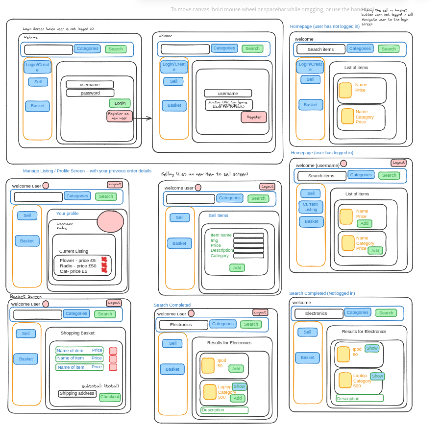
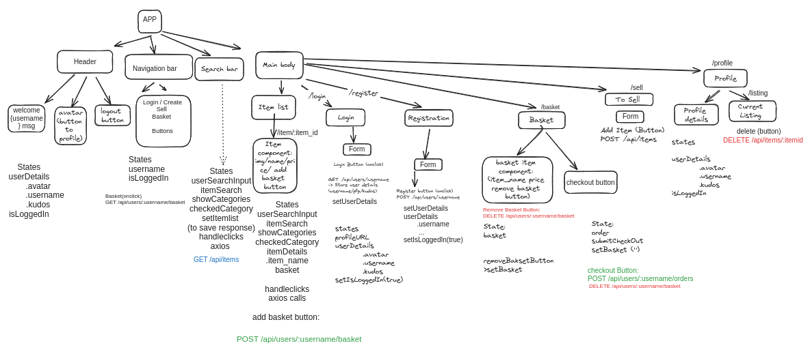
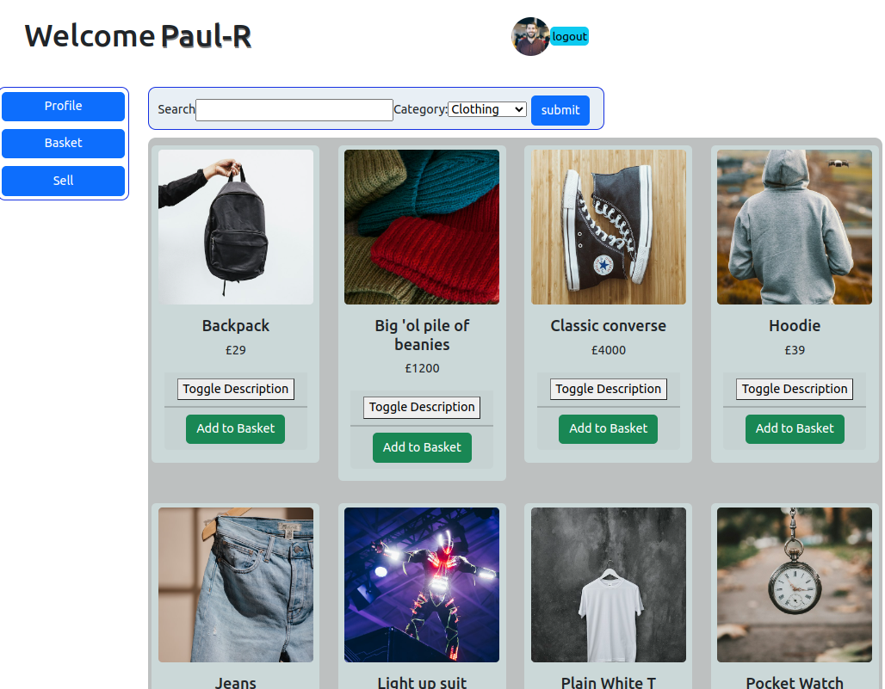

# NC Marketplace

## 3 day project to make a React App

- Create a user-friendly interface for a rudimentary API that allow users to retrieve, add, and manage their items.
- Implement pair-programming development techniques with driver writing code while the other, navigator, reviews the code and guide the driver, switching roles twice a day.
---
### Day 1
1. Planned for app.
2. Defined user stories.
3. Defined different routes.
4. Created component Tree defining States needed.
5. Defined API calls.

---

### Day 2
1. Coded wireframe basic structure:
    - File system structure (parent/child components, utils)
    - API calls
    - Basic styling
2. Implemented 3 main user stories (MVP):
    - Able to search things 
    - Able to see navigation bar 
    - Able to see thing list of tiems. 

---

### Day 3
1. Implemented more user stories.
    - Login screen 
    - Logout button works 
    - register new user screen 
    - fix: see the itemlist when homepage is loaded regardless user is logged in or not.
    - add basket button 
    - basket screen (still need to fix the basket list update, look up reactdocumentation)
    - profile screen (with edit current listing)

2. Applied more appealing design using a mix of **Bootstrap-react** and **Vanilla CSS**.
    - Button
    - Form
    - Table
    - Card

---

# Planned user stories: 
    As a user, I can view a list of available items.
    As a user, I can view a list of items for a particular category.
    As a user, I can list an item to sell.
    As a user, I can order an item.
    As a user, I can delete an item listing if I change my mind. (this user story has been abandoned as the current database doesn't support sold item w seller details and it is wrong to save what the user has sold in the local or to handle this information in the front end build.)
    As a user, I can view which items I have previously ordered.
    As a user, I can add an item to my basket to order later if I am still browsing.
    As a user, I can view which items I have added to my basket.
    As a user, I can remove items from my basket.
    As a user, I can create a new user profile.

UXUI / WireFrame:
https://excalidraw.com/#room=7a86c1702b42048ec1db,LriBALUzWphiz7kEJKvGFA

Component Diagram: 
https://excalidraw.com/#room=6f86291eb2fccb672f13,6jZU9yia4TBb-qTdhkbwbg

